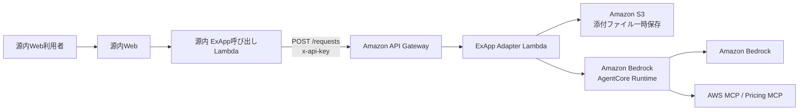
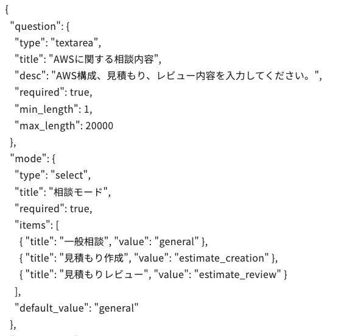
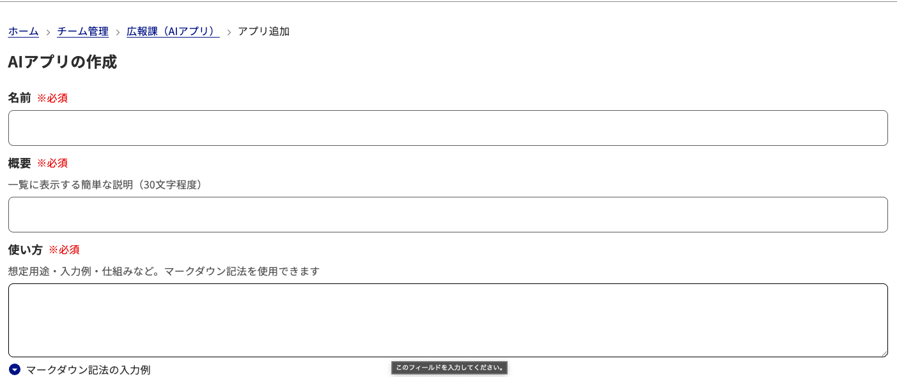
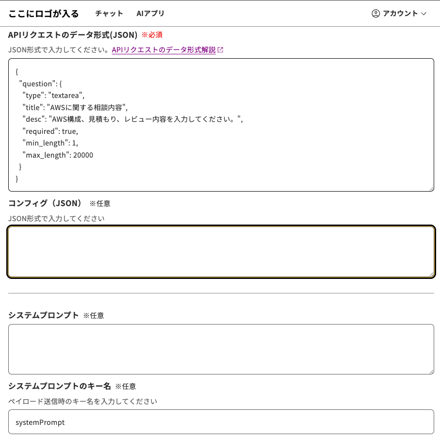
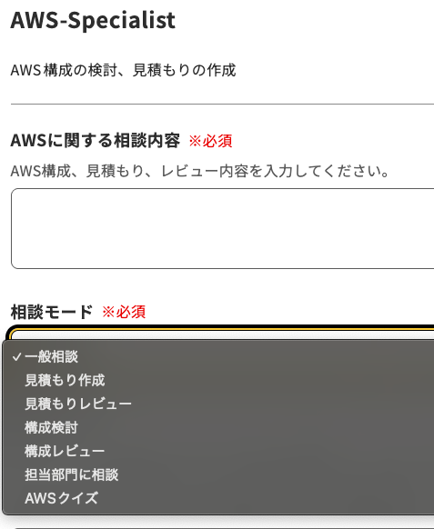

# ExAppを実際に作ってみた

## 1. 今回作ったもの

源内WebのExAppとして、AWSの構成相談や概算見積もりを支援する「AWS Specialist」を接続するための資材を作成した。

AWS Specialistは、もともとAPI Gateway、Lambda、Amazon Bedrock AgentCore Runtimeで構成された独立アプリケーションである。今回は、そのバックエンドを源内Webから呼び出せるように、源内のAIアプリAPI仕様へ適合させた。

作成した資材は`custom-aws-spe`ディレクトリにまとめている。

- AWS CDKによるインフラ定義
- 源内とAgentCoreの形式を変換するLambda
- AWS SpecialistのAgentCoreコンテナ
- 源内登録用のリクエスト形式JSON
- 単体テスト
- デプロイ・登録手順

現時点では、コード作成、型検査、単体テスト、CDK synthまで完了している。AWS環境への実デプロイと源内Webからの疎通確認は次の工程である。

## 2. 構成



源内Webが直接AgentCore Runtimeを呼ぶのではなく、API Gatewayと変換Lambdaを間に置く。

変換Lambdaには次の役割を持たせた。

1. 源内から送られる`inputs`をAWS Specialistの入力形式へ変換する
2. 源内の疑似チャット履歴をAgentCoreの会話履歴へ変換する
3. Base64形式の添付ファイルをS3へ一時保存する
4. AgentCoreのストリーミング応答を最後まで受信する
5. 回答本文を源内が期待する`outputs`形式で返す

## 3. 源内とAWS SpecialistのAPI形式を合わせる

### 3.1 源内から送られるリクエスト

源内Webは、画面で入力された値を`inputs`配下に格納して送信する。

```json
{
  "inputs": {
    "question": "このAWS構成をレビューしてください",
    "mode": "architecture_review",
    "conversation_histories": []
  },
  "sessionId": "70bb623d-b199-4fe5-8eb2-31c1d5b788b6"
}
```

### 3.2 AgentCoreへ渡す形式

AWS Specialistは、質問、作業モード、会話履歴、添付ファイルを個別のフィールドとして受け取る。

```json
{
  "prompt": "このAWS構成をレビューしてください",
  "mode": "architecture_review",
  "history": [],
  "attachments": []
}
```

源内の`sessionId`はAgentCoreの`runtimeSessionId`として使用する。これにより、源内側の会話とAgentCoreの実行セッションを対応付けられる。

### 3.3 源内へ返す形式

AgentCoreは回答をServer-Sent Eventsで逐次返す。一方、現在のExAppは同期JSONレスポンスを扱うため、変換Lambdaでテキストイベントを連結する。

```json
{
  "outputs": "## 診断サマリ\n構成上の主な確認点は次のとおりです。"
}
```

この`outputs`のMarkdownが源内Webの結果画面に表示される。

## 4. 源内側の入力画面をJSONで定義する

源内Webでは、AIアプリ登録時にリクエスト形式をJSONで指定する。今回は次の入力項目を定義した。

| 項目 | UI | 内容 |
| --- | --- | --- |
| AWSに関する相談内容 | テキストエリア | 構成、見積もり、レビュー内容を入力する |
| 相談モード | セレクトボックス | 一般相談、見積もり作成、構成検討などを選択する |
| 添付ファイル | ファイル選択 | テキスト、CSV、JSON、画像を添付する |

相談モードには次の選択肢を用意した。

- 一般相談
- 見積もり作成
- 見積もりレビュー
- 構成検討
- 構成レビュー
- 担当部門に相談
- AWSクイズ

入力項目と選択肢は、次のようなJSONで定義する。



JSONを登録すると、源内Webが入力画面を自動生成する。個別のフロントエンドを新しく開発する必要はない。

## 5. 源内Webへ登録する

管理者は、対象チームの「AIアプリの作成」画面からAWS Specialistを登録する。



前半では、アプリ名、概要、使い方を入力する。後半では、CDKデプロイで出力されたAPIエンドポイント、APIキー、リクエスト形式JSONを登録する。



登録値は次のとおりである。

| 登録項目 | 設定内容 |
| --- | --- |
| 名前 | AWS Specialist |
| 概要 | AWS構成・見積もり・レビューを支援するAIアプリ |
| APIエンドポイント | CDK出力の`ExAppEndpoint` |
| APIキー | API Gatewayで発行したAPIキー |
| APIリクエストのデータ形式 | `custom-aws-spe/exapp-config.json` |
| ステータス | 疎通確認後に公開 |

API Gatewayには送信元IP制限を設定していない。呼び出し元は利用者ブラウザではなく源内側のLambdaであり、Lambdaが固定送信元IPを持つとは限らないためである。アクセス制御にはAPIキー、Usage Plan、スロットリングを使用する。

## 6. デモで確認する流れ

実環境でのデモでは、次の順序で確認する。

1. 源内Webへログインする
2. AWS Specialistを登録したチームへ移動する
3. AIアプリ一覧からAWS Specialistを開く
4. 「構成レビュー」を選択する
5. AWS構成と要件を入力して実行する
6. 回答がMarkdownで表示されることを確認する
7. 続けて質問し、会話履歴が引き継がれることを確認する
8. 必要に応じて画像やテキストファイルを添付する

AWS Specialistの利用画面も、既存ExAppと同様にJSON定義から生成される。定義したテキストエリアと相談モードの選択肢が画面に反映される。



## 7. 実装して分かったこと

### 7.1 バックエンドはそのままでは接続できない

API Gateway、Lambda、AgentCoreがすでに存在していても、API契約が異なれば源内からそのまま利用できない。今回の中心的な実装は、AIエージェント自体ではなく、リクエスト、会話履歴、添付、レスポンスを変換するアダプターである。

### 7.2 ストリーミング方式の違いを吸収する必要がある

AWS Specialistは逐次表示を前提としていたが、今回は源内の同期レスポンスへ合わせた。そのため、利用者には回答が完成してからまとめて表示される。応答時間が長くなる場合は、源内の`202 Accepted`と`status_url`を使う非同期方式への変更が必要になる。

### 7.3 添付ファイルにはサイズ制約がある

源内からファイルはBase64形式で送られるため、元ファイルよりデータ量が増える。API Gatewayのペイロード上限を考慮し、現状は1ファイル4MB、最大5ファイルの画面定義としている。ただし、実際に同時送信できる総量はAPI全体の上限内に収める必要がある。

### 7.4 ExAppによりUI開発を省略できる

テキストエリア、セレクトボックス、ファイル入力をJSONで定義できるため、AWS Specialist専用の画面を源内側へ実装する必要がなかった。外部AIアプリはバックエンドの機能開発に集中し、入口、認証、チーム公開は源内へ任せられる。

## 8. 今後の改善点

- AWS環境へデプロイし、源内WebとのE2E疎通試験を行う
- 長時間処理を源内の非同期API方式へ変更する
- PDF、Word、Excel、PowerPointの抽出処理を追加する
- APIキーの定期ローテーション手順を整備する
- CloudWatchアラームと利用量監視を追加する
- AgentCoreのツール利用状況と回答時間を計測する
- 源内のチーム・ユーザー情報と利用ログを関連付ける

## 9. この章で伝えたいこと

> 源内のExAppは、外部AIアプリを単にリンクとして並べる機能ではない。API契約を合わせることで、既存のAIエージェントを源内共通の画面、認証、チーム管理の下へ組み込める。

今回のAWS Specialistでは、既存のAPI Gateway、Lambda、AgentCore Runtimeを活用し、接続部分だけを源内仕様へ適合させた。これにより、AIアプリごとにポータルや公開範囲管理を作り直さず、源内から組織単位で提供できる見通しを得た。
